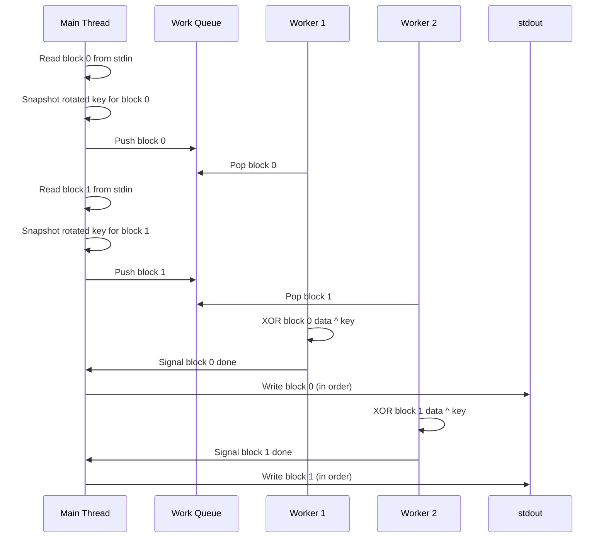
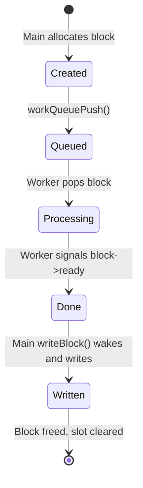
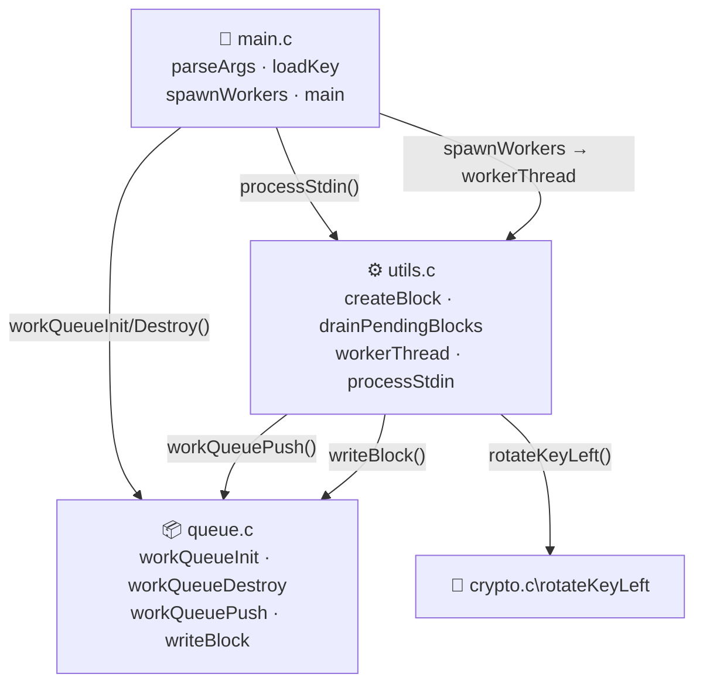
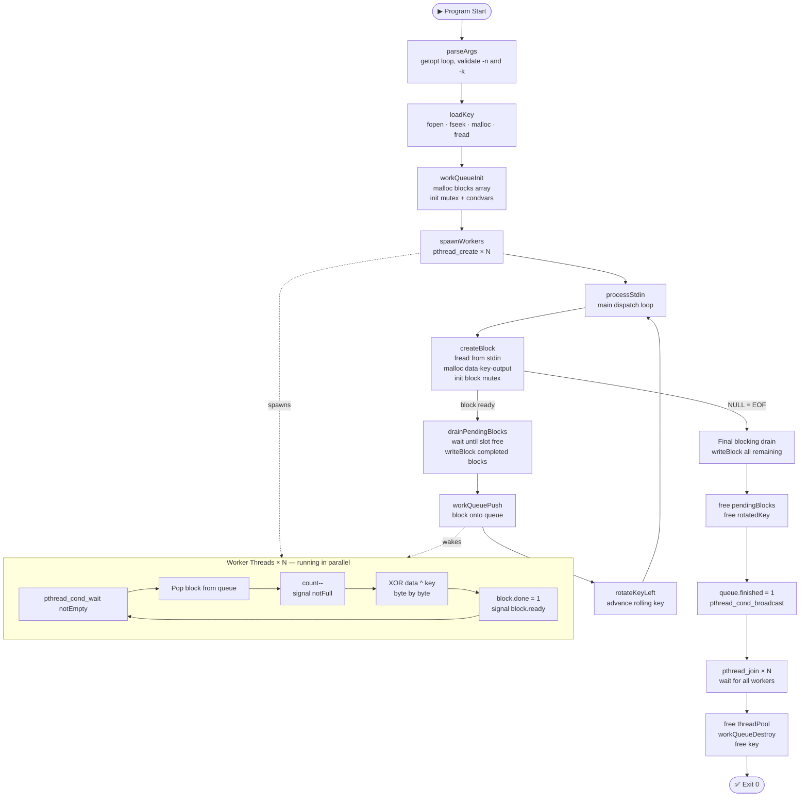

# 🔐 encryptUtil — XOR Stream Encryption Utility

A multi-threaded XOR stream cipher utility written in C for UNIX platforms.
Reads plaintext from `stdin`, encrypts it using a key file, and writes
ciphertext to `stdout`. All status and error messages go to `stderr`.

Designed to handle **arbitrarily large input** (far exceeding available memory),
process data **in parallel** across multiple CPU cores, and produce
**byte-identical output** regardless of how many threads are used.

---

## 📋 Requirements

- GCC with C99 support
- POSIX threads (`libpthread`)
- UNIX platform (Linux or macOS)
- Python 3 (for the test suite only)

---

## 🔨 Build

```bash
# Release build
make

# Debug build — includes debug symbols and ThreadSanitizer
# Catches data races and threading bugs at runtime
make debug

# Remove all build artifacts
make clean
```

---

## 🚀 Usage

```
encryptUtil [-n #] [-k keyfile]

Options:
  -n #        Number of worker threads to create (default: 1)
  -k keyfile  Path to the binary file containing the encryption key
```

### Examples

```bash
# Encrypt a file using 4 threads
./encryptUtil -n 4 -k key.bin < plaintext.bin > ciphertext.bin

# Decrypt — XOR is self-inverse, so encrypting twice restores the original
./encryptUtil -n 4 -k key.bin < ciphertext.bin > recovered.bin

# Pipe directly from another command
echo "Hello" | ./encryptUtil -n 2 -k key.bin > out.bin

# Verify round-trip correctness
./encryptUtil -n 4 -k key.bin < input.bin | \
./encryptUtil -n 4 -k key.bin > recovered.bin
cmp input.bin recovered.bin && echo "✅ Match"
```

---

## 🧠 How It Works

### The XOR Transform

The key file is read entirely into memory at startup. Its size in bytes
defines the **block size** — plaintext is broken into block-sized chunks,
each XOR'd byte-by-byte against the key.

```
plaintext:  [ 0x41 0x42 0x43 ]    (e.g. "ABC")
key:        [ 0x0F ]               (1-byte key → block size = 1)

Block 0:  0x41 ^ 0x0F = 0x4E
Block 1:  0x42 ^ 0x1E = 0x5C      (key rotated left 1 bit)
Block 2:  0x43 ^ 0x3C = 0x7F      (key rotated left 2 bits)

ciphertext: [ 0x4E 0x5C 0x7F ]
```

After each block is processed, the key is **rotated left by one bit**
across all key bytes treated as a single wide integer. This means the
key sequence repeats every `N × 8` blocks, where `N` is the key size in bytes.

#### Key rotation visualized (3-byte key example)

```
Before rotation:
  byte[0]       byte[1]       byte[2]
[ b7 b6 b5 b4 b3 b2 b1 b0 | b7 ... b0 | b7 ... b0 ]
    ↑ MSB wraps all the way to LSB of last byte

After rotation:
[ b6 b5 b4 b3 b2 b1 b0 | next.b7 ] ... [ b0 | wrapped.b7 ]
```

The last block may be shorter than the key — only the bytes that were
read are XOR'd, so output length always equals input length exactly.

#### Why XOR makes decryption free 🔄

XOR is its own inverse: `(data ^ key) ^ key = data`. Since the key
rotation sequence is fully deterministic, running `encryptUtil` twice
on the same data with the same key always restores the original — no
separate decrypt binary needed.

---

### Streaming Design 🌊

Input is **never fully buffered** — blocks are read one at a time from
`stdin` and written to `stdout` in order as they complete. This allows
the utility to handle inputs that are **arbitrarily large**, far exceeding
available memory. Memory usage stays bounded at `O(N)` where N is the
thread count — not input size.

> **Why this matters:** if the utility buffered all of stdin before
> processing, a 100GB input would require 100GB of RAM. The streaming
> design keeps memory usage constant regardless of input size.

---

### Multi-threading Architecture 🧵



The producer-consumer pattern keeps all CPU cores busy while main
handles I/O:

```
Main thread (producer + collector)        Worker threads (consumers)
──────────────────────────────────        ─────────────────────────
Read block from stdin                     Wait for block in queue
Snapshot rotated key for this block  →→→  Pop block from queue
Push block to work queue                  XOR data ^ pre-rotated key
Drain any completed blocks           ←←←  Signal block done
Write completed output to stdout          Wait for next block
```

#### Why pre-rotate the key per block? 🔑

The naive approach would be to share one rolling key across all threads,
rotating it as each block is assigned. But this would require a lock
on every rotation — **serializing the very work we're trying to parallelize**.

Instead, the main thread **snapshots a copy of the current key** for each
block before dispatching it. Workers receive a fully independent key buffer
and never need to coordinate with each other or with main on key state.

```
❌ Shared rotating key (requires lock on every block):
   Main → lock → rotate → copy → unlock → dispatch
                  ↑ serialized, defeats parallelism

✅ Pre-rotated snapshot per block (zero contention):
   Main → copy key → rotate → dispatch
   Workers read their own copy, fully independent
```

---

### Output Ordering Guarantee 📋

Threads finish in unpredictable order — a slow block might hold up
faster ones behind it. To guarantee in-order output, each `Block` struct
carries its own `pthread_mutex_t` and `pthread_cond_t`:



The main thread always writes in submission order — even if block 3
finishes before block 1, main waits on block 1's condition variable
before advancing. This guarantees byte-identical output regardless of
thread count or scheduling order.

---

### Memory Safety: The `pendingBlocks` Circular Array 🛡️

The `pendingBlocks[]` array tracks all in-flight blocks (those pushed
to the queue but not yet written to stdout). It is sized exactly equal
to the thread count, creating a bounded window of blocks in flight.

#### Why a mandatory drain before reuse?

A subtle bug discovered during testing: the work queue and the
`pendingBlocks` tracking array have **independent notions of "slot free"**.
A block can leave the work queue (because a worker popped it) long
before it's marked `done` and written to stdout.

Without protection, this sequence causes a pointer overwrite:

```
blockIdx=0: pendingBlocks[0] = block0   ← stored
blockIdx=1: pendingBlocks[1] = block1
...
blockIdx=N: pendingBlocks[N % capacity] = blockN  ← OVERWRITES block0's slot!
            even if block0 was never written to stdout
```

The fix: before storing a new block into `pendingBlocks`, drain completed
slots until the destination slot is guaranteed `NULL`:

```c
// Mandatory drain — guarantees no overwrite
while (pendingBlocks[blockIdx % capacity] != NULL) {
    writeBlock(pendingBlocks[nextToWrite % capacity]);
    pendingBlocks[nextToWrite % capacity] = NULL;
    nextToWrite++;
}
pendingBlocks[blockIdx % capacity] = block;  // slot guaranteed free
```

---

### Synchronization Primitives Used 🔒

| Primitive | Location | Purpose |
|---|---|---|
| `queue->lock` | `WorkQueue` | Protects `head`, `tail`, `count`, `finished` |
| `queue->notEmpty` | `WorkQueue` | Workers wait here when queue is empty |
| `queue->notFull` | `WorkQueue` | Producer waits here when queue is full |
| `block->lock` | `Block` | Protects `block->done` |
| `block->ready` | `Block` | Main waits here until worker signals done |

#### The `count` field vs the reserved-slot trick

A common circular buffer technique detects "full" when
`(tail + 1) % capacity == head`, reserving one slot as a sentinel.
This was **rejected** because:

- It wastes one usable slot
- At `capacity = 1` (i.e. `-n 1`), `(0+1)%1 == 0 == head` is **always true**,
  making the queue permanently appear full and deadlocking the producer immediately

An explicit `count` field was used instead:

```c
// Full check with reserved-slot trick — broken at capacity=1:
while ((queue->tail + 1) % queue->capacity == queue->head) { wait; }

// Full check with count field — correct at all capacities including 1:
while (queue->count == queue->capacity) { wait; }
```

This bug was caught by the `-n 1` test case and would have been invisible
in code review alone — it only manifests at runtime.

---

### The `notFull` Signal — A Subtle Threading Bug 🐛

When a worker pops a block from the queue, it must signal `notFull` to
wake the producer if it's blocked waiting for a free slot:

```c
queue->count--;
pthread_cond_signal(&queue->notFull);  // ← critical
pthread_mutex_unlock(&queue->lock);
```

Without this signal, the producer blocks on `workQueuePush` forever once
the queue fills — even though workers are actively consuming blocks and
`count` is decreasing. This was confirmed by a test with 1MB input and
`-n 4` (capacity 4), which deadlocked after exactly 4 blocks were pushed.

> **Lesson learned:** every `wait` on a condvar must have a matching
> `signal` on the corresponding state change, in every code path that
> changes that state.

---

## 📁 Project Structure

```
encryptUtil/
├── include/
│   ├── crypto.h      — rotateKeyLeft prototype, BIT_KEY_ROTATION and LSB_MASK macros
│   ├── queue.h       — Block and WorkQueue structs; workQueueInit, workQueueDestroy, workQueuePush, writeBlock prototypes
│   └── utils.h       — workerThread, createBlock, drainPendingBlocks, processStdin prototypes
├── src/
│   ├── main.c        — parseArgs · loadKey · spawnWorkers · main (pure orchestration, ~40 lines)
│   ├── crypto.c      — rotateKeyLeft
│   ├── queue.c       — WorkQueue init/destroy/push · writeBlock
│   └── utils.c       — createBlock · drainPendingBlocks · workerThread · processStdin
├── tst/
│   ├── run_tests.sh    — self-contained test script (40 cases, 7 categories, macOS + Linux)
│   └── test_report.txt — static snapshot of a passing test run
├── Makefile
└── README.md
```

### Module responsibilities



### Function-level breakdown

#### 🔧 `main.c` — CLI, key loading, thread lifecycle

All three helper functions are declared `static` — private to `main.c`,
not part of any public interface. `main()` itself is ~40 lines of pure
wiring with no business logic.

| Function | Responsibility |
|---|---|
| `parseArgs` | Parses `-n` and `-k` via `getopt`; validates thread count using `strtol` with `errno` and `INT_MAX` range check; returns 0/1 |
| `loadKey` | Opens key file; checks `fseek` and `ftell` for errors before casting; mallocs buffer; freads bytes; returns pointer |
| `spawnWorkers` | Mallocs thread pool, calls `pthread_create` for each, handles partial failure with join+cleanup |
| `main` | Calls the three helpers in order, runs `processStdin`, joins threads, frees everything |

> 💡 **Why `static`?** `parseArgs`, `loadKey`, and `spawnWorkers` are local
> implementation details — not reusable APIs. Marking them `static` prevents
> accidental external linkage and signals to any reader that these are private
> helpers, not exported symbols.

#### ⚙️ `utils.c` — I/O orchestration

| Function | Responsibility |
|---|---|
| `createBlock` | Reads one block from stdin, allocates and initializes all Block fields including mutex/condvar. Returns NULL on EOF. |
| `drainPendingBlocks` | Mandatory blocking drain — loops until `pendingBlocks[blockIdx % capacity]` is NULL, writing and freeing blocks in order |
| `workerThread` | Consumer loop — pops blocks from queue, XORs data against key, signals block done |
| `processStdin` | Top-level orchestration — read loop, dispatch, drain, shutdown signal |

#### 📦 `queue.c` — Block and WorkQueue lifecycle

| Function | Responsibility |
|---|---|
| `workQueueInit` | Mallocs `blocks[]` array, zeroes all fields, inits mutex + both condvars; returns 0 on success, 1 on failure |
| `workQueueDestroy` | Frees `blocks[]`, destroys mutex + condvars |
| `workQueuePush` | Blocks on `notFull` when full, inserts at tail, increments `count`, signals `notEmpty` |
| `writeBlock` | Waits on `block->ready`, copies output pointer and length, releases lock, fwrites outside lock, checks return value, destroys sync primitives, frees all sub-buffers and struct |

> 💡 **Why is `writeBlock` in `queue.c` and not `utils.c`?** `writeBlock`
> directly accesses `block->lock` and `block->ready` — the Block struct's
> synchronization internals. Any function that reaches into a struct's private
> locking mechanism belongs in the same module that owns that struct. Splitting
> it out would scatter `Block` synchronization logic across two files, making
> thread safety harder to audit in one place.

#### 🔐 `crypto.c` — Pure bit manipulation

| Function | Responsibility |
|---|---|
| `rotateKeyLeft` | Left-rotates a byte array by 1 bit in-place, wrapping the MSB of byte[0] to the LSB of byte[key_len-1] |

No I/O, no threading, no dependencies beyond `stdint.h`. Fully isolated
and independently testable.

### Call flow through the program



---

## 🧪 Testing

The test suite lives in `tst/` and covers **40 cases across 7 categories**.

### Running the tests

```bash
# Build first, then run from the project root
make
bash tst/run_tests.sh
```

The script creates its own temporary fixtures in `/tmp`, runs all 40 tests,
prints a detailed report to stdout, and exits with code `0` on all-pass
or `1` if any test fails. Compatible with both Linux and macOS — no
external dependencies beyond `bash`, `python3`, and `od`.

> ⚠️ **macOS note:** the script auto-detects whether `timeout`, `gtimeout`
> (Homebrew coreutils), or a pure-bash fallback should be used. No extra
> install required.

### Key fixtures used

| File | Contents | Purpose |
|---|---|---|
| `key_1byte.bin` | `0x0F` | Hand-verifiable single-byte rotation |
| `key_3byte.bin` | `0xA1 0xB2 0xC3` | Non-power-of-two key width |
| `key_4byte.bin` | `0xDE 0xAD 0xBE 0xEF` | Primary multi-block test key |
| `key_7byte.bin` | `0x11..0x77` | Another non-power-of-two width |
| `key_16byte.bin` | 16 bytes | Multi-byte rotation stress |
| `key_large.bin` | 256 bytes (`0x00–0xFF`) | Key larger than most inputs |
| `key_empty.bin` | empty | Error handling verification |
| `key_noperm.bin` | `0xAB 0xCD`, mode `000` | Permission-denied error path |

### Test categories

| Category | IDs | Count | What is verified |
|---|---|---|---|
| 🛡️ CLI / Error Handling | CLI-01 – CLI-10 | 10 | Missing args, bad/empty/unreadable key file, invalid thread counts (`0`, `-1`, `abc`), edge flags |
| ✅ Correctness: Known Values | COR-01 – COR-07 | 7 | Hand-computed XOR output, partial/exact/multi-block, binary input, large 256-byte key |
| 🔄 Round-trip | RT-key_1byte, RT-key_4byte, RT-key_16byte | 3 | `encrypt(encrypt(x)) == x` across three key sizes on 256KB random input |
| 🔍 Edge Cases | EDGE-01 – EDGE-08 | 8 | Empty stdin, single byte, large byte count, non-power-of-two key widths (3-byte, 7-byte), 16-byte rotation |
| 🧵 Multi-thread Determinism | DET-n2, DET-n4, DET-n8, DET-n16 | 4 | n=1 vs n=2/4/8/16 produce byte-identical output |
| 😴 Thread Starvation | STARV-01 – STARV-04 | 4 | N threads > block count: idle threads exit cleanly, no deadlock, correct output |
| 💪 Stress / Large Input | STR-n1, STR-n8, STR-n16, STR-RT | 4 | 256KB input across thread counts, round-trip with 16-byte key and n=8 |
| | **Total** | **40** | |

### Thread starvation tests — why they matter 😴

The starvation category (`STARV-01` – `STARV-04`) tests a scenario the spec
implies but doesn't state explicitly: **what happens when you spawn more
threads than there are blocks to process?**

With `plain_3block.bin` (exactly 3 blocks) and `-n 16`, thirteen worker
threads will find the queue empty and `finished=1` — they must exit cleanly
via the `count == 0 && finished` branch in `workerThread` without hanging,
crashing, or producing wrong output. This verifies that the shutdown signal
logic is correct even under minimal load.

```
16 threads spawned → queue has 3 blocks max
├── 3 threads: pop a block, XOR, signal done, exit loop
└── 13 threads: see count==0 && finished=1 → exit cleanly ✅
```

### Hand-verified reference case (COR-01) 🧮

This is the ground-truth correctness check — manually computed before
running any code, then verified against actual output:

```
Key:       0x0F  =  0000 1111
Plaintext: "ABC" =  0x41  0x42  0x43

Block 0:  key = 0x0F (0000 1111)  →  0x41 ^ 0x0F = 0x4E
Block 1:  key = 0x1E (0001 1110)  →  0x42 ^ 0x1E = 0x5C  (rotated 1 bit)
Block 2:  key = 0x3C (0011 1100)  →  0x43 ^ 0x3C = 0x7F  (rotated 2 bits)

Expected ciphertext: 4e 5c 7f
Actual output:       4e 5c 7f  ✅
```

### Bugs caught only through testing 🐞

These bugs were invisible in code review — they only manifested at runtime:

| Bug | How triggered | Root cause |
|---|---|---|
| `-n 1` deadlock | `COR-01` with single thread | Reserved-slot trick makes `capacity=1` queue always appear full |
| Large input deadlock | Stress test with 1MB+ input | Missing `pthread_cond_signal(&queue->notFull)` after worker pops a block |
| Segfault / wrong output | Stress test with small capacity | `pendingBlocks[blockIdx % capacity]` overwrites live pointer before slot is freed |

### Regenerating the test report

```bash
bash tst/run_tests.sh > tst/test_report.txt
```

---

## 🏗️ Design Decisions

### Why `capacity = thread count` for the work queue?

Bounding the queue to N slots means at most N blocks exist in memory
simultaneously — one per thread. This keeps memory usage `O(N)` regardless
of input size, satisfying the "arbitrarily large input" constraint.

A larger queue (e.g. `N*2`) would improve throughput slightly by allowing
read-ahead, but introduces a "why 2x?" justification problem without
benchmark evidence. `N` is simple, correct, and easy to reason about.

### Why `count` instead of the reserved-slot trick?

The reserved-slot trick (`(tail+1)%capacity == head` means full) is
common in textbook implementations but has a fatal edge case: at
`capacity=1`, the check is always true — the queue can never accept a
single block. This caused a confirmed deadlock on `-n 1` during testing.

An explicit `count` field is self-documenting, correct at all capacities,
and costs one extra `size_t` — well worth the tradeoff.

### Why `static` helpers in `main.c`?

`parseArgs`, `loadKey`, and `spawnWorkers` are declared `static` — they
are private to `main.c` and not part of any public interface. This
prevents accidental external linkage and signals clearly to any reader
that these functions are local implementation details, not reusable APIs.

### Why signal `notFull` before unlocking in `workerThread`?

```c
queue->count--;
pthread_cond_signal(&queue->notFull);  // signal BEFORE unlock
pthread_mutex_unlock(&queue->lock);
```

Signaling under the lock avoids a race where the producer could wake up,
re-check `count == capacity` (still true), and go back to sleep — all
between the worker's unlock and signal. Signaling first guarantees the
producer sees the updated `count` when it wakes.

### Why is `writeBlock` in `queue.c` rather than `utils.c`?

`writeBlock` directly accesses `block->lock` and `block->ready` — the
`Block` struct's synchronization internals. Any function that reaches
into a struct's private locking mechanism belongs in the same module
that owns that struct. Splitting it into `utils.c` would scatter
`Block` synchronization logic across two files, making it harder to
reason about thread safety in one place.

### Why move the `finished` signal after the final drain?

A reviewer suggested signaling `queue->finished = 1` before the final
blocking drain. This would cause a deadlock:

```
❌ Signal finished BEFORE drain:
   Main sets finished=1 → workers see empty queue + finished → workers EXIT
   Main calls writeBlock() → waits on block->ready → workers already gone
   → deadlock: nobody left to signal block->ready

✅ Signal finished AFTER drain (current design):
   Main's final drain calls writeBlock() → workers signal each block->ready
   Workers finish signaling → main writes each block → drain completes
   Main sets finished=1 → workers see empty queue + finished → workers EXIT cleanly
```

Workers don't need `finished=1` to keep processing — they keep running
as long as blocks exist in the queue. `finished` only tells them to stop
*waiting* once the queue is empty and no more blocks are coming.

---

## 👤 Author

Azkary Garcia with the help of Claude.ai — July 2026
